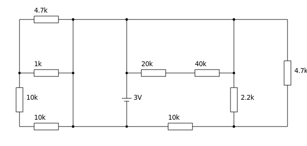

# Akiha-circuit

Akiha-circuit draws electric circuit diagram by ASCII-art.  
Document is [here](http://akiha.morilib.net/circuit/index.html).

Input:  
```
  4.7k
*-v^v-*---*--------------*---------*
|     |   |              |         |
| 1k  |   | 20k   40k    |         |
*-v^v-*   *-v^v---v^v----*         |
|     |   |              |         |
<10k  |   |3V            <2.2k     <4.7k
>     |  ---             >         >
<     |   -              <         <
|     |   |              |         |
| 10k |   | 10k          |         |
*-v^v-*---*-v^v----------*---------*
```

Output:  


